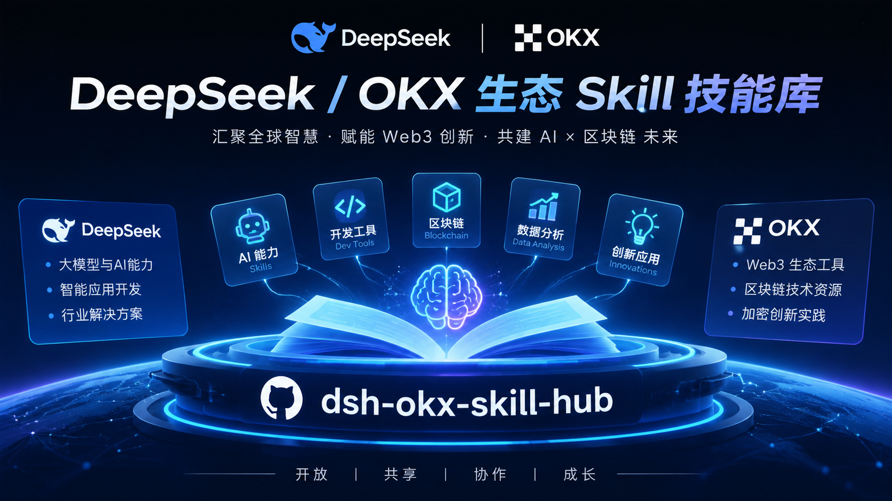

# dsh-okx-skill-hub

<p align="center">
  
</p>

Plug-and-play OKX Agent Skills adapted for **DeepSeek Harness (DSH)**.

This repo ports the official OKX [`okx-cex-market`](https://www.okx.com/en-us/agent-tradekit/skills/okx-cex-market) skill (from [okx/agent-skills](https://github.com/okx/agent-skills)) into the DSH skill ecosystem with **two install channels**: a plain `skills/` directory (copy & run) and a `dsh-plugin` bundle (one-command install / uninstall).

## What's inside

| Skill | Description | Included | API key |
|---|---|---|---|
| [`okx-cex-market`](skills/okx-cex-market/SKILL.md) | Live market data: price / ticker / order book / candles / funding rate / open interest / 70+ technical indicators (RSI, MACD, EMA, Bollinger, KDJ, SuperTrend, AHR999, BTC Rainbow, …) | ✅ | ❌ (read-only public data) |
| `okx-cex-portfolio` | Balance & positions | 🚧 PR welcome | ✅ |
| `okx-cex-trade` | Place / cancel orders | 🚧 PR welcome | ✅ |
| `okx-cex-bot` | Grid / DCA bots | 🚧 PR welcome | ✅ |

## Why this works out of the box

DSH and OKX use the **same skill convention** (`<name>/SKILL.md` with `name`/`description` frontmatter plus a `references/` resource dir), so the official skill drops in with **zero rework**. Verified end-to-end on a live DSH instance (discovery → catalog → `skill` tool load).

## Install

### Option 1 — plain skill directory (no deps)

```bash
git clone https://github.com/<your-org>/dsh-okx-skill-hub.git
cp -r dsh-okx-skill-hub/skills/okx-cex-market ~/.dsh/skills/
cp -r dsh-okx-skill-hub/skills/_shared ~/.dsh/skills/
# or project-scoped:
cp -r dsh-okx-skill-hub/skills/okx-cex-market <project-root>/.dsh/skills/
cp -r dsh-okx-skill-hub/skills/_shared <project-root>/.dsh/skills/
```

Or run the one-liner installer:

```powershell
powershell -ExecutionPolicy Bypass -File install.ps1           # user level
powershell -ExecutionPolicy Bypass -File install.ps1 -Project   # project level
```

```bash
./install.sh            # user level
./install.sh --project  # project level
```

### Option 2 — dsh-plugin bundle (one command, clean uninstall)

```bash
git clone https://github.com/<your-org>/dsh-okx-skill-hub.git
cd dsh-okx-skill-hub
dsh plugin --profile web add .
# or repository-plugin form:
dsh plugin --profile web add <your-org>/dsh-okx-skill-hub#main&path:/.dsh-plugin
```

The bundle registers a dedicated `okx-hub` skill provider exposing only this repo's `skills/` dir — it never touches your user/project skill roots. Uninstall: `dsh plugin --profile web remove dsh-okx-skill-hub`.

### Runtime dependency: the `okx` CLI

```bash
npm install -g @okx_ai/okx-trade-cli
okx market ticker BTC-USDT   # verify
```

Market commands are read-only and need **no API key**. Trading skills require `OKX_API_KEY` / `OKX_SECRET_KEY` / `OKX_PASSPHRASE` (or `okx auth login` OAuth).

## Example prompts

- "What's BTC at right now?" → `okx market ticker BTC-USDT`
- "Show me ETH 4h candles" → `okx market candles ETH-USDT --bar 4H`
- "Funding rate for BTC-USDT perp" → `okx market funding-rate BTC-USDT-SWAP`
- "RSI and MACD on BTC daily" → `okx market indicator rsi/macd BTC-USDT`
- "Top 24h gainers among perps" → `okx market filter --instType SWAP --sortBy chg24hPct`

## Layout

```
dsh-okx-skill-hub/
├── skills/                          # ① plain directory channel
│   ├── _shared/preflight.md         #    shared OKX CLI preflight (official)
│   └── okx-cex-market/              #    official skill, verbatim port
│       ├── SKILL.md                 #    main skill (frontmatter + command index)
│       ├── _meta.json               #    official signed metadata (sha256-verifiable)
│       └── references/              #    5 command reference docs
├── .dsh-plugin/                     # ② plugin channel (dsh plugin add)
│   ├── package.json                 #    repository-plugin manifest
│   └── cordis.patch.yml             #    patch: registers the okx-hub provider
├── package.json                     #    npm bundle manifest (dsh.bundle)
├── install.ps1 / install.sh         #    one-click installers
└── docs/ADAPTATION.md               #    adaptation & verification notes
```

## Roadmap

- [x] `okx-cex-market` port, dual-channel install, verified on live DSH
- [ ] Port `okx-cex-portfolio` / `okx-cex-trade` / `okx-cex-bot`
- [ ] Auto-sync script tracking official OKX versions (sha256-checked)
- [ ] Tag `dsh-plugin` / `dsh-skill`, submit to awesome lists & plugin markets
- [ ] CI: signature verification + frontmatter lint

## Credits & license

- Skill content © [OKX](https://github.com/okx/agent-skills) (MIT). This repo only adapts & distributes for the DSH ecosystem.
- Wrapper code (plugin, scripts, docs): MIT.

## Links

- [OKX Agent Skills](https://github.com/okx/agent-skills) · [OKX Skills Marketplace](https://www.okx.com/en-us/agent-tradekit/skills/okx-cex-market)
- [DeepSeek Harness](https://github.com/deepseek-ai/deepseek-harness) · skill format: `packages/skill/skill-filesystem` in the official repo
